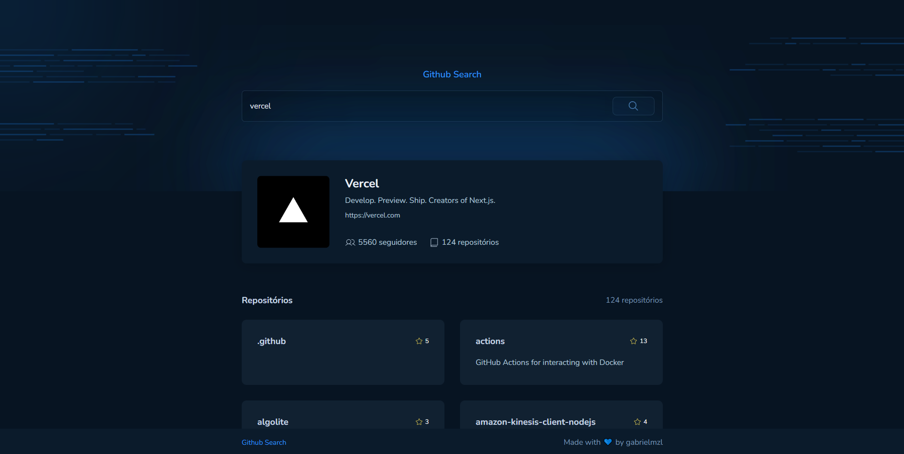

<h1 align="center">
  
</h1>
<br>
<p align="center">
  <a href="#-projeto">Projeto</a>&nbsp;&nbsp;&nbsp;|&nbsp;&nbsp;&nbsp;
  <a href="#-tecnologias">Tecnologias</a>&nbsp;&nbsp;&nbsp;|&nbsp;&nbsp;&nbsp;
  <a href="#-executando-o-projeto">Executando o projeto</a>&nbsp;&nbsp;&nbsp;|&nbsp;&nbsp;&nbsp;
</p>

<br>


<p align="center">
  
  
  
  
</p>

<p align="center">
  <a href="https://github-search.bohr.io">Clique aqui</a> para acessar a versão web
</p>

## ✨ Projeto

Com esse site você consegue obter informações sobre um perfil do Github de forma simplificada e rápida. 

## 🚀 Tecnologias

Esse projeto foi desenvolvido com as seguintes tecnologias/bibliotecas:

<table border="0">
 <tr>
<td> HTML5</td>
<td> CSS3</td>
<td> Javascript</td>
<td> React.JS</td>
 </tr>
 <tr>
<td> Vite</td>
<td> Styled Components</td>
<td> Axios</td>
<td> Skeleton Loader</td>
 </tr>
</table>

## 👨🏻‍💻 Executando o projeto

Utilize o **yarn** ou o **npm install** para instalar as dependências do projeto.
Em seguida, inicie o projeto.

Iniciando a versão web:

```cl
yarn start ou npm run dev
```